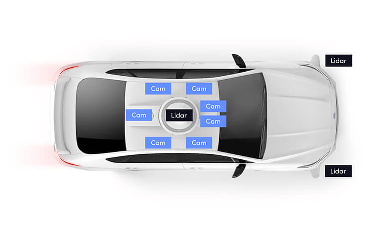
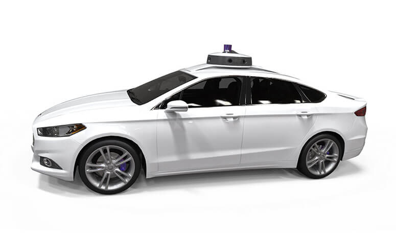

# Download scripts for level-5 (lyft) dataset

You actually don't need an account to download it.

```bash
wget "https://lyft-l5-datasets-public.s3-us-west-2.amazonaws.com/3d-object-detection/test.tar"
wget "https://lyft-l5-datasets-public.s3-us-west-2.amazonaws.com/3d-object-detection/train.tar"
wget "https://lyft-l5-datasets-public.s3-us-west-2.amazonaws.com/3d-object-detection/one_scene.tar"
```

It's a relative small dataset, so just use the above scripts is enough.

For train/val split, you can refer to [mmdetection3d's documentataion](https://github.com/open-mmlab/mmdetection3d/blob/master/docs/en/datasets/lyft_det.md)

There are few repos to reference with:

l5kit: https://github.com/woven-planet/l5kit

lyft dataset sdk: https://github.com/lyft/nuscenes-devkit

|                                                                                                            Lidar                                                                                                            |                                                                                                                 Camera                                                                                                                  |
| :-------------------------------------------------------------------------------------------------------------------------------------------------------------------------------------------------------------------------: | :-------------------------------------------------------------------------------------------------------------------------------------------------------------------------------------------------------------------------------------: |
|                                                                                                                                                                                      |                                                                                                                                                                                                 |
| Our vehicles are equipped with 40 and 64-beam lidars on the roof and bumper. They have an Azimuth resolution of 0.2 degrees and jointly produce ~216,000 points at 10 Hz. Firing directions of all lidars are synchronized. | Our vehicles are also equipped with six 360° cameras built in-house. One long-focal camera points upward. Cameras are synchronized with the lidar so the beam is at the center of each camera’s field of view when images are captured. |
